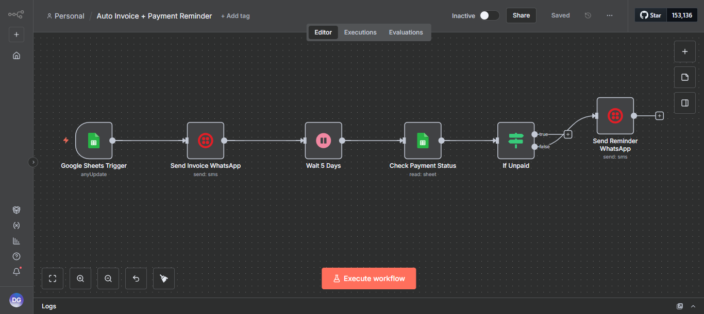
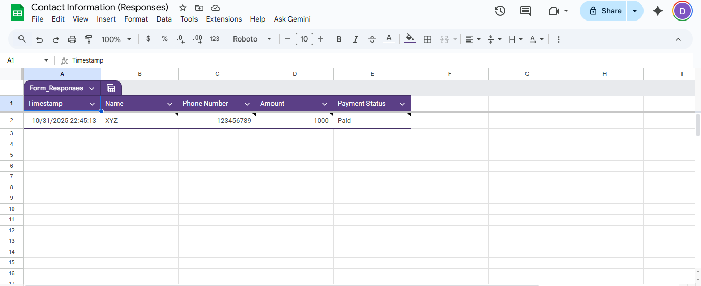
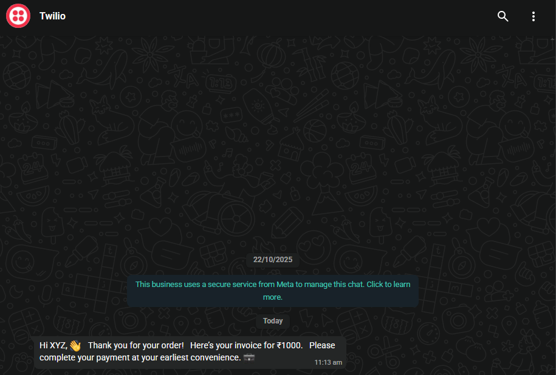

# 💰 Invoice & Payment Reminder Workflow (n8n)

This workflow automatically sends WhatsApp reminders for invoices using **Google Sheets + Twilio API**.

## 🚀 Features
- Triggers when a new row is added in Google Sheets
- Sends personalized WhatsApp reminders via Twilio
- Helps freelancers and businesses stay on top of payments

## 🧠 Tech Used
- n8n (Open-source automation tool)
- Twilio API
- Google Sheets

## 🗂 How to Use
1. Import the `invoice_reminder.json` file into n8n.
2. Update your Twilio credentials (SID & Auth Token).
3. Connect your Google Sheets account.
4. Activate the workflow!

## 📸 Screenshots

### 🧩 Workflow Overview

### 🗃️ Google Sheet Data

### WhatsApp Message Example

---
**Made with ❤️ using n8n**
